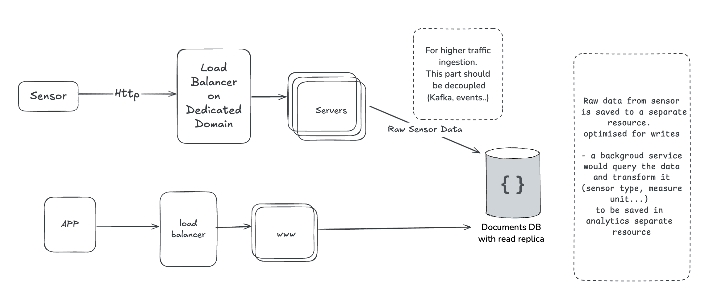
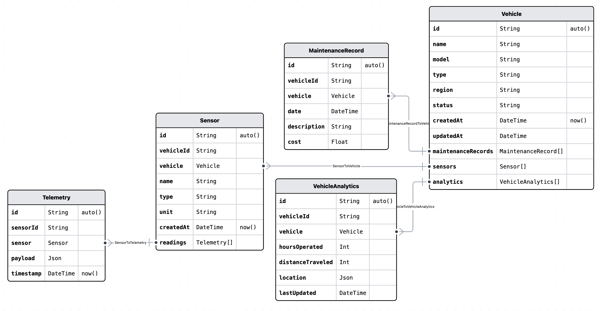
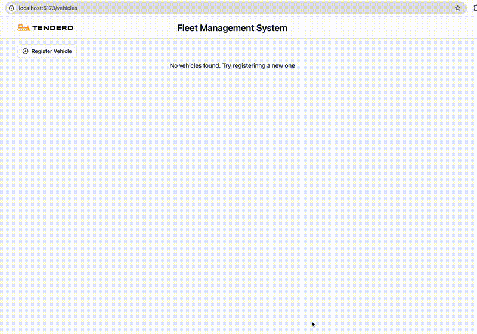

# Fleet Management System

● Develop a simplified version of a Fleet Management System that allows users to track and
manage different vehicles used in logistics, construction, or any other fleet-intensive industry.

● Simulate IoT devices sending real-time data to the backend (like location, speed ...)

## Overview

### System Design

#### Future Improvements to scale.

- IoT is a heavy traffic domain, Ingesting the traffic should be done separately, we can decouple it using Kafka when it's time to scale.

- Sensors requests should be saved as is. (raw) for reconsiliation and history purposes. a separate high traffic DB (like Cassandra) might be used to store telemetry data.

- A background service is enough for this demo API. but for a production scale. an ETL setup with a data warehouse is needed. for reporting and queries
- Sensor are not limited to HTTP (websocket also should be supported)

## DB Schema

#### Future Improvements

- SensorType: A separate Collection, and Sensor should reference the Id to control the allowed types and add more validation

- VehicleType: A separate Collection for Vehicle Types. Vehicle model should reference it for type

- VehicleAnalytics: the current setup allows a single analytic/vehicle. in a real world app. analytics should be a time series. (rollups) where we can see the history (by Stat_date, Stat_hour)

## Design Reasoning

#### Why separate Sensor, Telemetry models?

The system models real-world telemetry in three distinct layers to maintain flexibility, and performance:

#### Sensor: metadata

Each Sensor represents a sensor (e.g., GPS, engine temperature) mounted on a vehicle. Separating sensors from raw data allows the system to:

- Associate a vehicle with multiple sensors, even of the same type (e.g., engine vs. cabin temperature).
- Reuse sensor metadata (type, unit) across readings and time.
- Enable per-sensor validation and contextual analytics.

#### Telemetry: raw time-series data

Each sensor reading (payload + timestamp) is stored as a Telemetry entry:

- Ensures raw data is retained for future reprocessing, auditing, or analytics.
- Keeps Sensor documents lean and avoids MongoDB’s document size limits.
- Enables time-based queries and indexing via sensorId + timestamp.

This design supports high-frequency ingestion with clean separation of concerns.

#### VehicleAnalytics: latest state view

The VehicleAnalytics model maintains the latest aggregated data per vehicle, updated as new telemetry is ingested. This includes:

- Current location, total distance, or hours operated.
- A single record per vehicle (with a @unique vehicleId constraint).
- Lightweight updates during ETL runs or live ingestion simulations.

### Live Updates

Adding a sensor to a vehicle will start showing data

## Setup

checkout [Readme.md](./FMS_API/readme.md) for setup

## Tech Stack

- #### Database
  - MongoDb with Prisma
- #### API
  - Node with Express (typescript)
  - Zod for validation
  - Winston for logging and daily rotation
  - Jest for testing
  - Swagger: API Documentation
- #### FrontEnd
  - React + Vite with TypeScript
  - Zod + react-hook-form for validation
  - Shadcn + Tailwind for styling
  - Leaflet + leaflet-react for map
  - @tanstack/react-query + suspense for async loading
  - react-error-boundary for catching runtime errors
  - playwright for E2E testing
